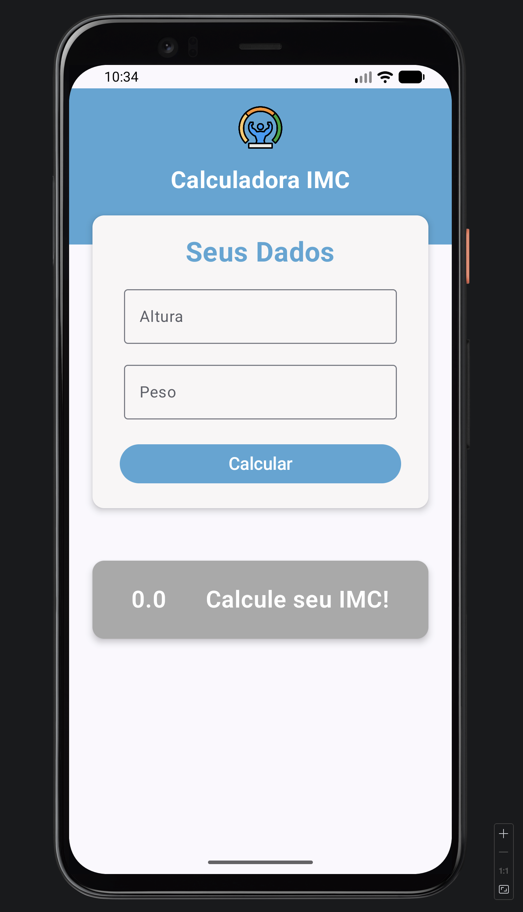

# Calculadora de IMC

## Descrição
Este projeto consiste em uma calculadora de IMC (Índice de Massa Corporal) desenvolvida em Kotlin, utilizando conceitos fundamentais de desenvolvimento para aplicações Android. 
O objetivo do projeto é permitir que o usuário informe peso e altura para calcular automaticamente o seu IMC e apresentar a classificação correspondente.

## Funcionalidades
* Entrada de peso e altura pelo usuário

* Cálculo automático do IMC utilizando a fórmula:
IMC = peso / (altura * altura)

* Exibição do resultado do IMC

* Indicação da classificação do índice de acordo com os padrões da OMS

* Interface simples e intuitiva

## Tecnologias
* Kotlin
* Jetpack Compose
* Android Studio
* Git

## Autor
[Pedro Henrique]()